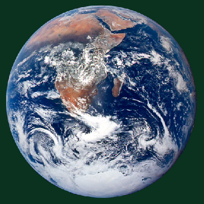

# pixmap-ops

Image manipulation demos based on the PPM image format.


## How to build

*Windows*

Open git bash to the directory containing this repository.

```
pixmap-ops $ mkdir build
pixmap-ops $ cd build
pixmap-ops/build $ cmake -G "Visual Studio 17 2022" ..
pixmap-ops/build $ start pixmap-ops.sln
```

Your solution file should contain two projects: `pixmap_art` and `pixmap_test`.
To run from the git bash command shell, 

```
pixmap-ops/build $ ../bin/Debug/pixmap_test
pixmap-ops/build $ ../bin/Debug/pixmap_art
```

*macOS*

Open terminal to the directory containing this repository.

```
pixmap-ops $ mkdir build
pixmap-ops $ cd build
pixmap-ops/build $ cmake ..
pixmap-ops/build $ make
```

To run each program from build, you would type

```
pixmap-ops/build $ ../bin/pixmap_test
pixmap-ops/build $ ../bin/pixmap_art
```

## Image operators

Operators Implemented:
1. `Image::rotate90()`: Rotates the image 90º clockwise.


2. `Image::invert()`: Inverts colors.


3. `Image::colorJitter(int size)`: Adds a random vector of the specified size to each pixel of the image.


4. `Image::channelShift(int rShift[2], int gShift[2], int bShift[2])`: Adds a specified offset to each channel of the image.


5. `Image::halftone(int rShift[2], int gShift[2], int bShift[2])`: Decomposes image into a grid of red, green, and blue dots.


6. `Image::colorReplace(const Pixel& oldColor, const Pixel& newColor, int tolerance)`: Replaces all pixels of color `oldColor` with `newColor`. Increasing `tolerance` expands the range of colors considered matching `oldColor`.



7. `Image::sobel()`: Produces a full-color Sobel filtered version of the image using horizontal and vertical kernels.


8. `Image::gaussianBlur(float sigma)`: Applies a Gaussian blur to the image using a Gaussian kernel with standard deviation `sigma`.


9. `Image::lightest(const Image& other)`: For each pixel, uses the image with the lightest color.


## Results


Uses `channelShift()`, `halftone()`, `colorReplace()`, and `lightest()`


Uses `sobel()`, `invert()`, and `colorReplace()`


Uses `colorReplace()` and `lightest()`